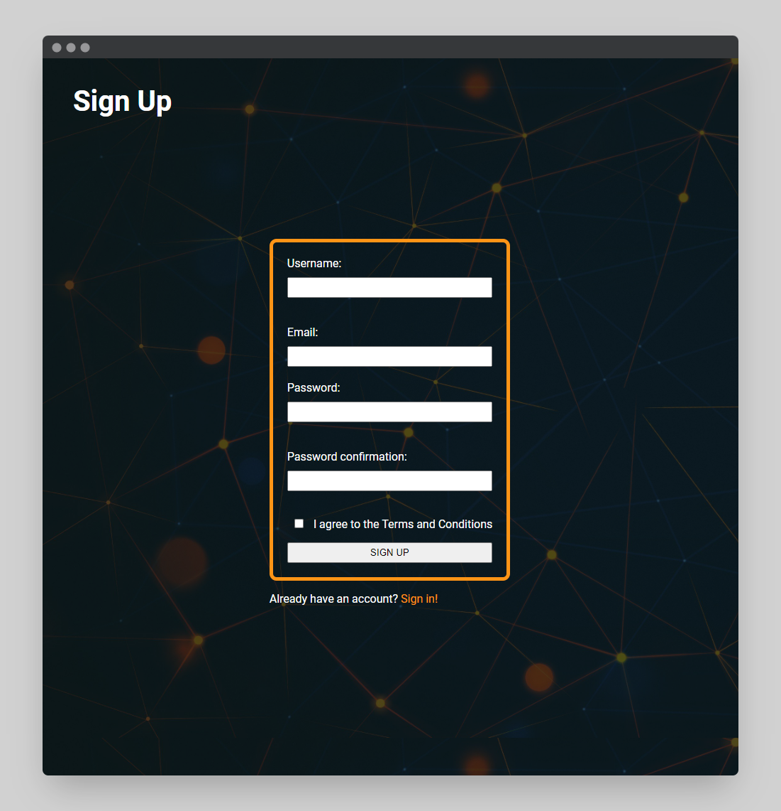
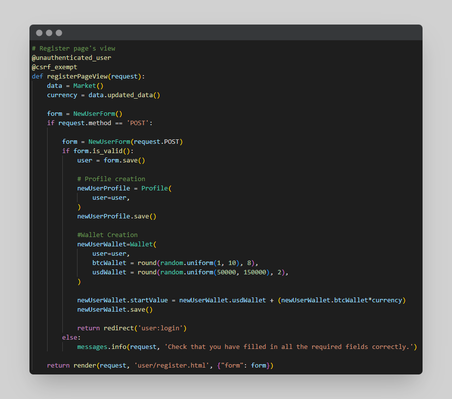
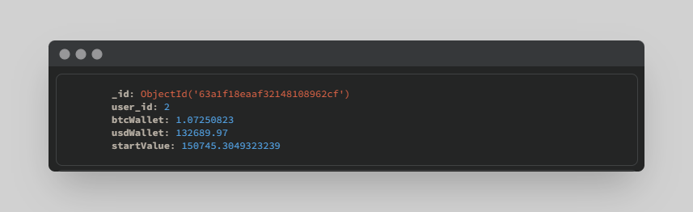
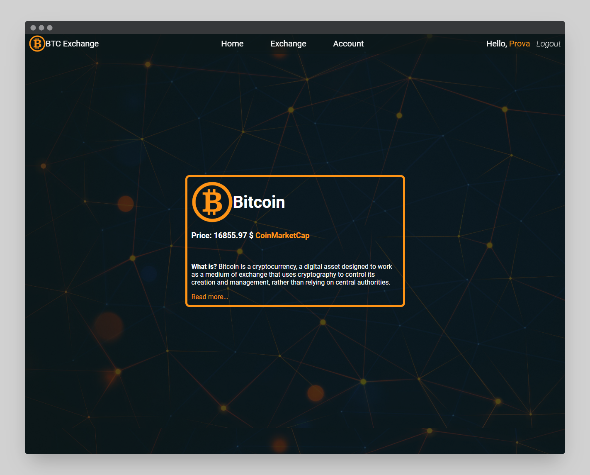
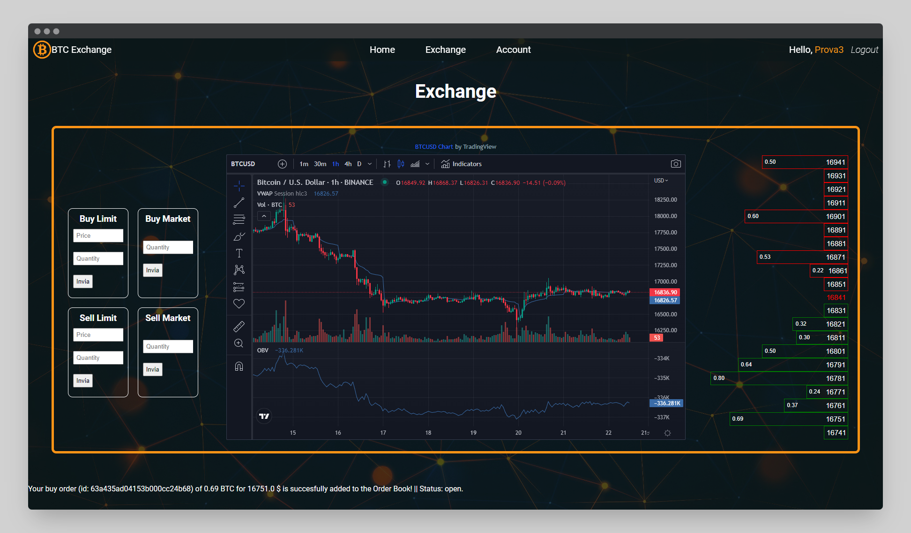
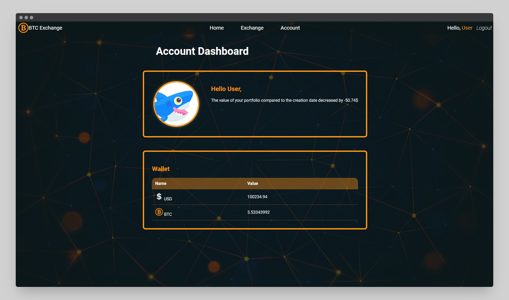

<h1 align="center">
    ₿ BTC Exchange Project
</h1>

<br/>

This project is a BTC Exchange where you can simulate trades with BTC (no real BTC are used).

The main purpose of this project is to show how to combine Django and MongoDB to make a powerful platform that manage all the orders.

<hr/>
  
## 🛠️&nbsp; How to run
- Have MongoDB installed

- Clone the repo
- Create and activate virtual enviroment
- Install requirements: --> 
    ```
    pip install -r requirements.txt
    ```
- Make database migrations: --> 
    ```
    python manage.py makemigrations
    ``` 
    ```
    python manage.py migrate
    ```
- Run server: --> 
    ```
    python manage.py runserver
    ```
- Open [http://127.0.0.1:8000/](http://127.0.0.1:8000/) in your browser

## 🗎&nbsp; Requirements

* The platform must have an endpoint to manage user registration and access.

* Automatically assign 1 to 10 bitcoins to each user.
* Each user can post one or more sales or purchase orders of a certain amount.
* At the time of publication, if the purchase price of the order is equal to or greater than the selling price of any other user, match the transaction and mark both orders as filled.
* Provide an endpoint to get all active buy and sell orders.
* Provide an endpoint to calculate the total profit or loss from each user's trades.
* Assume that the platform in question is totally free for users and does not retain any type of commission on operations.


## 🚀&nbsp; How it's suppose to work?

### Registration Process

When a user registers, a wallet associated with the user is automatically generated, containing a random value between 1 and 10 bitcoins and between 50k and 150k $.

<p align="center">
    
</p>

<p align="center">
    
</p>

<p align="center">
    
</p>

This wallet can be used to simulate BTC trades.

</br>

Once the user is logged in he will be redirected to the homepage, which display some information about BTC

<p align="center">
    
</p>

From here the user can access the <strong>Exchange</strong> page by clicking on the appropriate link in the navbar.

### Exchange Page

[Exchange Page View](https://github.com/Meno96/Exchange/blob/1bcb1f8b33218fcd282961b621bfe2e905107fb9/app/views.py#L66)

<p align="center">
    
</p>

The exchange page consists of:

* on the left there are some forms where it is possible to send limit orders and market orders into the system

* in the center there is the BTC chart provided by TradingView

* on the right there is the DOM (or Order Book) where it is possible to see all the currently active limit orders. It is shrinkable and stretchable so all price levels are visible to see if there are any orders.

### Account Page

<p align="center">
    
</p>

The account page gives us information about the total loss or total profit since we created the wallet.

It also gives us information on the balance of the BTC and USD wallet.

## 🏴‍☠️&nbsp; Add ons

There is an implementation to check if the login ip address is always the same or not for the admin user.

## 💭&nbsp; My thoughts

As a trading, crypto and blockchain enthusiast, it was very satisfying and useful to develop this exchange with the related order management.


## 📫&nbsp; Have a question? Want to chat? 

[LinkedIn](https://www.linkedin.com/in/daniele-menin/)

[Instagram](https://www.instagram.com/danielemeno96/)
